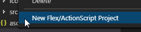
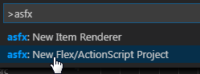
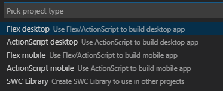
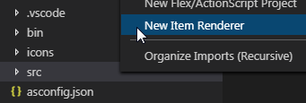
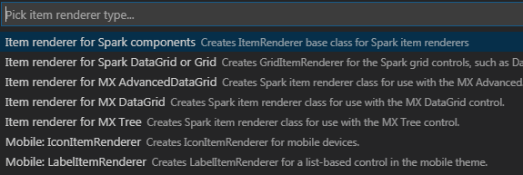

# vscode-as-fx-ide README

This extension helps creating ActionScript/Flex projects.

## Features

### New Project command

- creates project files in selected folder
- will ask to delete all files if selected folder is not empty
- reads AIR version from SDK's airsdk.xml, if not available uses 30.0

Run it with right click in Explorer menu:

or from Command Palette (Ctrl+Shift+P) by typing extension's name:

and pick project type:

### New Item Renderer command

- creates selected item renderer file

Run it by right click on folder:

and pick item renderer to be created:

