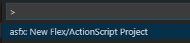

# vscode-as-fx-ide README

This extension helps creating ActionScript/Flex projects.

## Features

New Project command:

- creates project files in selected folder
- will ask to delete all files if selected folder is not empty
- reads AIR version from SDK's airsdk.xml, if not available uses 30.0 

## How to use

Install it:

https://marketplace.visualstudio.com/items?itemName=neminovno.vscode-as-fx-ide

Run it:

- with right click in Explorer menu:

- from Command Palette (Ctrl+Shift+P) by typing extension's name:

